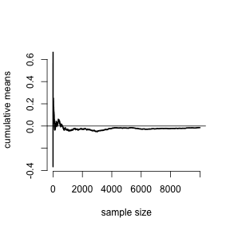
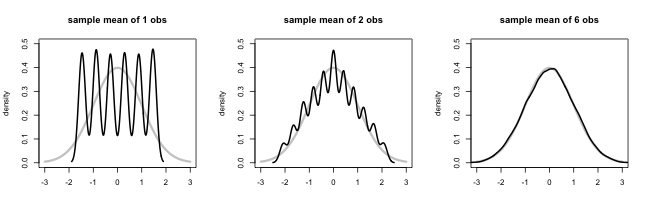
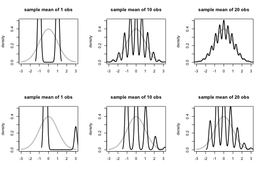

```
## Error: object 'opts_chunk' not found
```

```
## Error: object 'knit_hooks' not found
```

```
## Error: object 'knit_hooks' not found
```

## Asymptotics
* Asymptotics is the term for the behavior of statistics as the sample size (or some other relevant quantity) limits to infinity (or some other relevant number)
* (Asymptopia is my name for the land of asymptotics, where everything works out well and there's no messes. The land of infinite data is nice that way.)
* Asymptotics are incredibly useful for simple statistical inference and approximations 
* (Not covered in this class) Asymptotics often lead to nice understanding of procedures
* Asymptotics generally give no assurances about finite sample performance
  * The kinds of asymptotics that do are orders of magnitude more difficult to work with
* Asymptotics form the basis for frequency interpretation of probabilities 
  (the long run proportion of times an event occurs)
* To understand asymptotics, we need a very basic understanding of limits.


---
## Numerical limits

- Imagine a sequence

  - $a_1 = .9$,
  - $a_2 = .99$,
  - $a_3 = .999$, ...

- Clearly this sequence converges to $1$
- Definition of a limit: For any fixed distance we can find a point in the sequence so that the sequence is closer to the limit than that distance from that point on

---

## Limits of random variables

- The problem is harder for random variables
- Consider $\bar X_n$ the sample average of the first $n$ of a collection of $iid$ observations

  - Example $\bar X_n$ could be the average of the result of $n$ coin flips (i.e. the sample proportion of heads)

- We say that $\bar X_n$ converges in probability to a limit if for any fixed distance the  probability of $\bar X_n$ being closer (further away) than that distance from the limit converges to one (zero)

---

## The Law of Large Numbers

- Establishing that a random sequence converges to a limit is hard
- Fortunately, we have a theorem that does all the work for us, called
    the **Law of Large Numbers**
- The law of large numbers states that if $X_1,\ldots X_n$ are iid from a population with mean $\mu$ and variance $\sigma^2$ then $\bar X_n$ converges in probability to $\mu$
- (There are many variations on the LLN; we are using a particularly lazy version, my favorite kind of version)

---
## Law of large numbers in action

```r
n <- 10000
means <- cumsum(rnorm(n))/(1:n)
plot(1:n, means, type = "l", lwd = 2, frame = FALSE, ylab = "cumulative means", xlab = "sample size")
abline(h = 0)
```

 

---
## Discussion
- An estimator is **consistent** if it converges to what you want to estimate
  - Consistency is neither necessary nor sufficient for one estimator to be better than another
  - Typically, good estimators are consistent; it's not too much to ask that if we go to the trouble of collecting an infinite amount of data that we get the right answer
- The LLN basically states that the sample mean is consistent
- The sample variance and the sample standard deviation are consistent as well
- Recall also that the sample mean and the sample variance are unbiased as well
- (The sample standard deviation is biased, by the way)

---

## The Central Limit Theorem

- The **Central Limit Theorem** (CLT) is one of the most important theorems in statistics
- For our purposes, the CLT states that the distribution of averages of iid variables, properly normalized, becomes that of a standard normal as the sample size increases
- The CLT applies in an endless variety of settings
- Let $X_1,\ldots,X_n$ be a collection of iid random variables with mean $\mu$ and variance $\sigma^2$
- Let $\bar X_n$ be their sample average
- Then $\frac{\bar X_n - \mu}{\sigma / \sqrt{n}}$ has a distribution like that of a standard normal for large $n$.
- Remember the form
$$\frac{\bar X_n - \mu}{\sigma / \sqrt{n}} = 
    \frac{\mbox{Estimate} - \mbox{Mean of estimate}}{\mbox{Std. Err. of estimate}}.
$$
- Usually, replacing the standard error by its estimated value doesn't change the CLT

---

## Example

- Simulate a standard normal random variable by rolling $n$ (six sided)
- Let $X_i$ be the outcome for die $i$
- Then note that $\mu = E[X_i] = 3.5$
- $Var(X_i) = 2.92$ 
- SE $\sqrt{2.92 / n} = 1.71 / \sqrt{n}$
- Standardized mean
$$
    \frac{\bar X_n - 3.5}{1.71/\sqrt{n}}
$$ 

---
## Simulation of mean of $n$ dice
 

---

## Coin CLT

 - Let $X_i$ be the $0$ or $1$ result of the $i^{th}$ flip of a possibly unfair coin
- The sample proportion, say $\hat p$, is the average of the coin flips
- $E[X_i] = p$ and $Var(X_i) = p(1-p)$
- Standard error of the mean is $\sqrt{p(1-p)/n}$
- Then
$$
    \frac{\hat p - p}{\sqrt{p(1-p)/n}}
$$
will be approximately normally distributed

---

 


---

## CLT in practice

- In practice the CLT is mostly useful as an approximation
$$
    P\left( \frac{\bar X_n - \mu}{\sigma / \sqrt{n}} \leq z \right) \approx \Phi(z).  
$$
- Recall $1.96$ is a good approximation to the $.975^{th}$ quantile of the standard normal
- Consider
$$
    \begin{eqnarray*}
      .95 & \approx & P\left( -1.96 \leq \frac{\bar X_n - \mu}{\sigma / \sqrt{n}} \leq 1.96 \right)\\ \\
      & =       & P\left(\bar X_n +1.96 \sigma/\sqrt{n} \geq \mu \geq \bar X_n - 1.96\sigma/\sqrt{n} \right),\\
    \end{eqnarray*}
$$

---

## Confidence intervals

- Therefore, according to the CLT, the probability that the random interval $$\bar X_n \pm z_{1-\alpha/2}\sigma / \sqrt{n}$$ contains $\mu$ is approximately 100$(1-\alpha)$%, where $z_{1-\alpha/2}$ is the $1-\alpha/2$ quantile of the standard normal distribution
- This is called a $100(1 - \alpha)$% **confidence interval** for $\mu$
- We can replace the unknown $\sigma$ with $s$

---
## Give a confidence interval for the average height of sons
in Galton's data

```r
library(UsingR)
data(father.son)
x <- father.son$sheight
(mean(x) + c(-1, 1) * qnorm(0.975) * sd(x)/sqrt(length(x)))/12
```

```
## [1] 5.710 5.738
```


---

## Sample proportions

- In the event that each $X_i$ is $0$ or $1$ with common success probability $p$ then $\sigma^2 = p(1 - p)$
- The interval takes the form
$$
    \hat p \pm z_{1 - \alpha/2}  \sqrt{\frac{p(1 - p)}{n}}
$$
- Replacing $p$ by $\hat p$ in the standard error results in what is called a Wald confidence interval for $p$
- Also note that $p(1-p) \leq 1/4$ for $0 \leq p \leq 1$
- Let $\alpha = .05$ so that $z_{1 -\alpha/2} = 1.96 \approx 2$ then
$$
    2  \sqrt{\frac{p(1 - p)}{n}} \leq 2 \sqrt{\frac{1}{4n}} = \frac{1}{\sqrt{n}} 
$$
- Therefore $\hat p \pm \frac{1}{\sqrt{n}}$ is a quick CI estimate for $p$

---
## Example
* Your campaign advisor told you that in a random sample of 100 likely voters,
  56 intent to vote for you. 
  * Can you relax? Do you have this race in the bag?
  * Without access to a computer or calculator, how precise is this estimate?
* `1/sqrt(100)=.1` so a back of the envelope calculation gives an approximate 95% interval of `(0.46, 0.66)`
  * Not enough for you to relax, better go do more campaigning!
* Rough guidelines, 100 for 1 decimal place, 10,000 for 2, 1,000,000 for 3.

```r
round(1/sqrt(10^(1:6)), 3)
```

```
## [1] 0.316 0.100 0.032 0.010 0.003 0.001
```

---
## Poisson interval
* A nuclear pump failed 5 times out of 94.32 days, give a 95% confidence interval for the failure rate per day?
* $X \sim Poisson(\lambda t)$.
* Estimate $\hat \lambda = X/t$
* $Var(\hat \lambda) = \lambda / t$ 
$$
\frac{\hat \lambda - \lambda}{\sqrt{\hat \lambda / t}} 
= 
\frac{X - t \lambda}{\sqrt{X}} 
\rightarrow N(0,1)
$$
* This isn't the best interval.
  * There are better asymptotic intervals.
  * You can get an exact CI in this case.

---
### R code

```r
x <- 5
t <- 94.32
lambda <- x/t
round(lambda + c(-1, 1) * qnorm(0.975) * sqrt(lambda/t), 3)
```

```
## [1] 0.007 0.099
```

```r
poisson.test(x, T = 94.32)$conf
```

```
## [1] 0.01721 0.12371
## attr(,"conf.level")
## [1] 0.95
```


---
## In the regression class

```r
exp(confint(glm(x ~ 1 + offset(log(t)), family = poisson(link = log))))
```

```
## Waiting for profiling to be done...
```

```
##   2.5 %  97.5 % 
## 0.01901 0.11393
```


